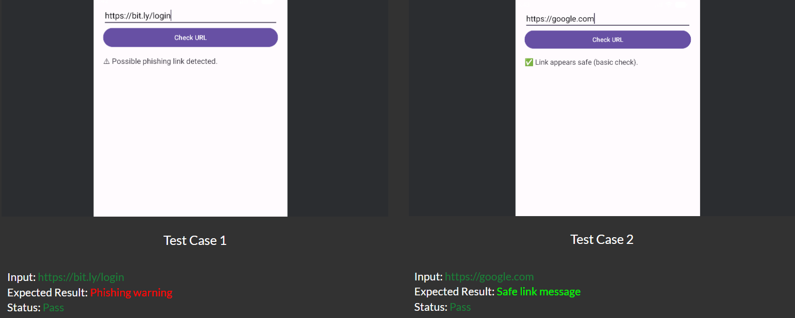

# PhishGuard Lite

A lightweight Android application built with Kotlin that detects common phishing indicators in URLs and provides educational feedback to users.

---

## Features

- URL analysis for common phishing indicators
- Educational feedback to users (safe vs. suspicious)
- URL history logging
- Emulator-based testing

---

## Tools & Technologies

| Tool | Purpose |
|---|---|
| Android Studio | IDE and emulator |
| Kotlin | App logic and activity handling |
| XML | UI layout design |
| Android Emulator | Manual testing |

---

## How It Works

The app checks a user-submitted URL for common phishing patterns such as URL shorteners and suspicious keywords. It returns one of two results:

- ✅ **Safe** — link appears legitimate
- ⚠️ **Warning** — possible phishing link detected

---

## Screenshots

### Home Screen

### Test Cases

---

## Test Results

| Input URL | Expected Result | Status |
|---|---|---|
| `https://bit.ly/login` | Phishing warning | ✅ Pass |
| `https://google.com` | Safe link message | ✅ Pass |

---

## Key Learning Outcomes

- Android UI development using XML layouts
- Kotlin-based activity logic and event handling
- Input validation and conditional processing
- URL history logging and feature implementation
- Emulator-based application testing
- Applying cybersecurity concepts to mobile applications

---

## Relevance to Cybersecurity

- Identifies phishing-related URL patterns
- Educates users on social engineering risks
- Simulates basic countermeasure logic in a mobile environment
- Practices secure input handling and feedback mechanisms

---

## Future Improvements

- Integrate VirusTotal API for real-time threat intelligence
- Store URL history using SQLite
- Add phishing email detection
- Implement machine learning–based URL classification
- Improve UI/UX and accessibility
- Deploy on a physical Android device
